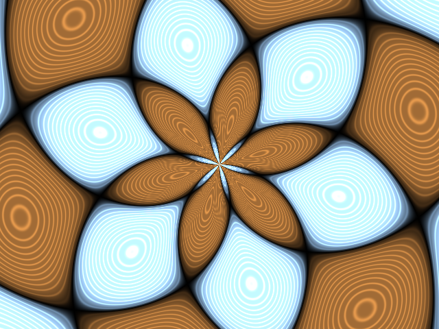

# Rings and Sectors - WebGL

An implementation of WebGL shaders using distance functions to generate patterns of rings, sectors and 4 combinations of these patterns.

### [Implementation](https://pedroravaglia.github.io/Rings-and-Sectors-WebGL/Rings_Sectors.html)

# About

In the vertex shader we simply draw two triangles that cover the whole canvas. After, we provide the code that computes the color of each pixel. But how to draw a primitive, a circle or a triangle, using only the fragment shader? The idea is to write code that tests each pixel and decides whether or not it is inside the primitive. Better still is to write a [*signed distance function*](https://en.wikipedia.org/wiki/Signed_distance_function#:~:text=In%20mathematics%20and%20its%20applications,whether%20x%20is%20in%20%CE%A9.) (SDF) for the primitive, that is, a function that returns how far the pixel is from the border of the primitive: a negative number if it is inside the primitive, or a positive number if outside.

Several modeling operators can be easily expressed with SDFs. For instance, if two shapes are described by SDFs A(p) and B(p), then the shape corresponding to their union and intersection are described by SDFs min(A(p), B(p)) and max(A(p), B(p)), respectively. Also, we can add and multiply these SDFs to generate different patterns.

Below we can see the patterns generated by the different combinations of rings and sectors SDFs:

 

<table>
  <tr>
    <th></th>
    <th></th>
    <th></th>
    <th></th>
  </tr>
  <tr>
    <th>Rings</th>
    <th>Sectors</th>
    <th>min (rings, sectors)</th>
    <th>max (rings, sectors)</th>
  </tr>
  <tr>
    <th></th>
    <th></th>
  </tr>
  <tr>
    <th>Rings + Sectors</th>
    <th>Rings * Sectors</th>
  </tr>
</table>

 
 

[Inigo Quilez](https://iquilezles.org/index.html) has a [great page with several such functions for 2D shapes](https://www.iquilezles.org/www/articles/distfunctions2d/distfunctions2d.htm), some of which we reproduce here:

 
 

# Dependencies

* [regl](https://github.com/regl-project/regl)
